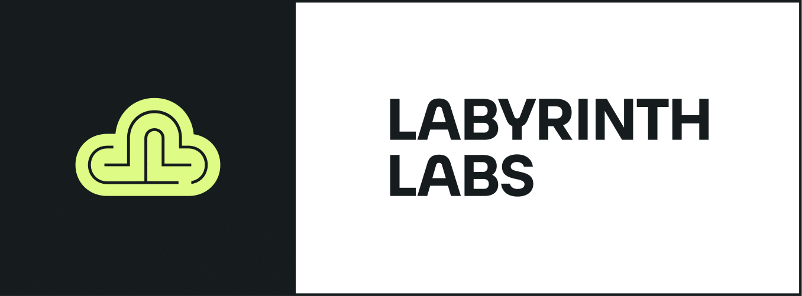

# arm-you-ready

[](https://lablabs.io/)

We help companies build, run, deploy and scale software and infrastructure by embracing the right technologies and principles. Check out our website at https://lablabs.io/

---

## Description

CLI tool for checking (primarily) ARM readiness of your Docker images.
This tool can help you asses your readiness for migration to nodes with different CPU architectures on your Kubernetes clusters. It's main purpose is to check your Deployments and determine whether the Docker images that you're using have a version built for the target architecture.
## Features

- checks deployments and prints out whether the images used have a version built for target CPU architecture

# Private repositories

Private repositories are currently not supported.
It is possible to authenticate against a private repo with Docker SDK ([example](https://docs.docker.com/engine/api/sdk/examples/#pull-an-image-with-authentication)), but it is hard to distinguish when to use/not to use auth when running this tool against a cluster with mix of public/private repo(s).

Therefore you might encounter errors such as
```
Error response from daemon: Head "https://registry-1.docker.io/v2/zlosim/zmq-fluent-bit/manifests/1.5.x-zmq": unauthorized: incorrect username or password
```

# Build

```
CGO_ENABLED=0 GOOS=linux go build .
```
## Usage

```
./arm-you-ready -namespace system -arch arm64
+-----------------------------+-----------+------------+-----------------------------------------------------------------+-----------------+---------------------------------+
| NAME                        | NAMESPACE | RESOURCE   | IMAGE                                                           | ARM64 SUPPORTED | ARCHITECTURES                   |
+-----------------------------+-----------+------------+-----------------------------------------------------------------+-----------------+---------------------------------+
| system-metrics-server       | system    | Deployment | k8s.gcr.io/metrics-server/metrics-server:v0.4.1                 | true            | [amd64 arm arm64 ppc64le s390x] |
| kube-metrics-adapter        | system    | Deployment | registry.opensource.zalan.do/teapot/kube-metrics-adapter:v0.1.9 | false           | [amd64]                         |
| system-external-dns         | system    | Deployment | docker.io/bitnami/external-dns:0.7.4-debian-10-r29              | false           | [amd64]                         |
| system-kubernetes-dashboard | system    | Deployment | kubernetesui/dashboard:v2.0.5                                   | true            | [amd64 arm arm64 ppc64le s390x] |
| system-kubernetes-dashboard | system    | Deployment | kubernetesui/metrics-scraper:v1.0.6                             | true            | [amd64 arm arm64 ppc64le s390x] |
+-----------------------------+-----------+------------+-----------------------------------------------------------------+-----------------+---------------------------------+
```

## Contributing and reporting issues

Feel free to create an issue in this repository if you have questions, suggestions or feature requests.

## License

[](https://opensource.org/licenses/Apache-2.0)

See [LICENSE](LICENSE) for full details.

    Licensed to the Apache Software Foundation (ASF) under one
    or more contributor license agreements.  See the NOTICE file
    distributed with this work for additional information
    regarding copyright ownership.  The ASF licenses this file
    to you under the Apache License, Version 2.0 (the
    "License"); you may not use this file except in compliance
    with the License.  You may obtain a copy of the License at

      https://www.apache.org/licenses/LICENSE-2.0

    Unless required by applicable law or agreed to in writing,
    software distributed under the License is distributed on an
    "AS IS" BASIS, WITHOUT WARRANTIES OR CONDITIONS OF ANY
    KIND, either express or implied.  See the License for the
    specific language governing permissions and limitations
    under the License.
